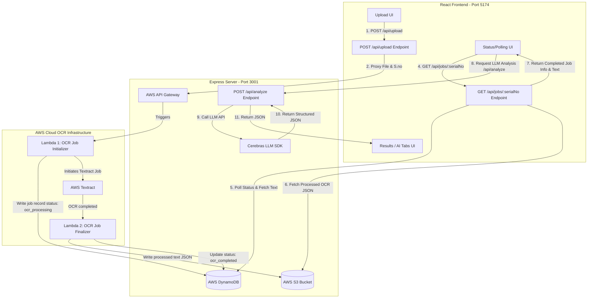

# ⚖️ Kanoon Sathi (कानून साथी)

**Kanoon Sathi** is an AI-powered legal document intelligence platform designed to extract, process, and analyze Indian legal documents (like sale deeds, lease deeds, etc.). By integrating a robust AWS-based OCR pipeline with Cerebras Cloud's high-speed LLM inference, it translates dense legal documents into clean, interactive, and structured visual insights.

---

## 🔍 Key Features

- **Document Ingestion**: Supports PDF, JPG, PNG, and TIFF formats up to 50MB.
- **Hybrid OCR Tracking**: Real-time polling and multi-strategy fallbacks to monitor AWS Textract pipeline status via DynamoDB & S3.
- **AI-Powered Legal Extraction**: High-speed structured legal analysis (using Cerebras' `gpt-oss-120b` model) covering summary, buyer/seller details, transaction timelines, and property parameters.
- **Interactive Ownership Graph**: High-fidelity visualization of relationships and entities in the deed using `@xyflow/react`.
- **Chronological Timeline**: Step-by-step transaction history extraction.

---

## 🏗️ System Architecture

Kanoon Sathi separates responsibilities into a client dashboard, a proxy/coordinator API server, and a cloud-based serverless OCR processing backend:



### Flow Breakdown
1. **Upload**: The user uploads a document with a unique serial number. The frontend posts to `/api/upload`.
2. **AWS Ingestion**: The backend proxies the file upload to the AWS API Gateway endpoint (`/prod/property`).
3. **OCR Start**: Lambda 1 records the job in DynamoDB as `ocr_processing` and starts AWS Textract.
4. **Polling & Fallbacks**: The frontend and backend poll the job state. If Lambda 2 completes the OCR, it writes the result to S3 and updates DynamoDB to `ocr_completed`. The backend automatically downloads the OCR text from S3 and caches it in memory.
5. **AI Extraction**: Once OCR is complete, the frontend sends the raw text to `/api/analyze`. The backend runs the document text through the Cerebras SDK using the `gpt-oss-120b` model to output deterministic JSON containing structured entities and relationships.
6. **Visualization**: The frontend parses the structured JSON to construct the AI summary, timeline, entity lists, and interactive `@xyflow/react` ownership node graph.

---

## 💻 Tech Stack

### Frontend
- **Framework**: [React 19](https://react.dev/) (via [Vite](https://vite.dev/))
- **Styling**: Vanilla CSS with custom scrollbars, animations, and glassmorphism.
- **Icons**: [Lucide React](https://lucide.dev/)
- **Graph Visualizer**: [@xyflow/react (React Flow)](https://reactflow.dev/)

### Backend
- **Framework**: [Express 5](https://expressjs.com/)
- **AI SDK**: [@cerebras/cerebras_cloud_sdk](https://cerebras.ai/)
- **Cloud SDK**: `@aws-sdk/client-s3`, `@aws-sdk/client-dynamodb`, and `@aws-sdk/lib-dynamodb`
- **File Handling**: `multer`, `form-data`

---

## 🔌 Local Ports Used

When running the application locally, it utilizes the following ports:

| Service | Port | Description |
| :--- | :--- | :--- |
| **Frontend** | `http://localhost:5174` | Vite React development server |
| **Backend** | `http://localhost:3001` | Express API server (requests to `/api/*` are proxied here) |

---

## 🚀 Setup and Run Locally

### 1. Prerequisites
- **Node.js**: Ensure Node.js (v18 or higher) and `npm` are installed.
- **AWS Credentials**: Active credentials with access to the designated DynamoDB table and S3 bucket.
- **Cerebras API Key**: An active key from [Cerebras Cloud Console](https://cloud.cerebras.ai/).

### 2. Install Dependencies
Navigate to the root directory and install the packages:
```bash
npm install
```

### 3. Environment Setup
Create a `.env` file in the project root. You can copy the example template provided:
```bash
cp .env.example .env
```
Open `.env` and fill in your keys and configuration details:
```env
CEREBRAS_API_KEY=your_cerebras_key_here
AWS_ACCESS_KEY_ID=your_aws_access_key_here
AWS_SECRET_ACCESS_KEY=your_aws_secret_key_here
AWS_REGION=ap-south-1
S3_BUCKET=lawdocuments2026
DYNAMODB_TABLE=kanoon-saathi-jobs
```

### 4. Running the Application
We provide script combinations to spin up both systems together or separately:

#### Run Frontend & Backend Simultaneously (Recommended)
This runs Vite and Node together using `concurrently`:
```bash
npm run dev
```

#### Run Separately
If you prefer separate terminal windows:
* Run the Express API server (Backend):
  ```bash
  npm run dev:backend
  ```
* Run the Vite dev server (Frontend):
  ```bash
  npm run dev:frontend
  ```

---

## 🛠️ Build and Production

To build the React static bundle for production:
```bash
npm run build
```
This generates the optimized static assets in the `dist` directory. You can preview the production bundle locally with:
```bash
npm run preview
```

---

## 🧩 API Endpoints Reference

### Local Express Server (`http://localhost:3001`)

- `POST /api/upload`
  - Uploads document file to S3 via API Gateway proxy.
  - **Body**: `multipart/form-data` containing `file` and `serial_no`.
- `GET /api/jobs`
  - Returns a list of all jobs currently cached or tracked in memory.
- `GET /api/jobs/:serialNo`
  - Returns status and raw OCR text for a specific serial number. If the backend local cache is incomplete, it dynamically queries DynamoDB/S3 using failover strategies.
- `POST /api/analyze`
  - Sends raw text to Cerebras Cloud.
  - **Body**: `{ "text": "OCR Text here..." }`
  - **Returns**: Structured legal entities, timeline, and relationships.
- `POST /api/ocr/webhook`
  - Webhook endpoint for the AWS OCR pipeline to immediately notify Express about completed Textract jobs.

---

## 🩺 Troubleshooting

### `concurrently: command not found`
If `npm run dev` fails with this error, it means `npm install` hasn't been run or node_modules is out of sync. Make sure to run `npm install` first so that `concurrently` is installed locally under `node_modules/.bin`.

### AWS Credentials Failures
On startup, the Express backend verifies connectivity to DynamoDB. If you see:
```text
❌ AWS credentials FAILED: ...
```
Ensure your `AWS_ACCESS_KEY_ID` and `AWS_SECRET_ACCESS_KEY` are correct, and the user has permissions to run `dynamodb:ListTables` and `dynamodb:Scan` on the table.

### Cerebras API Key Missing
If LLM Analysis fails on the results page, check the Express backend log output. The Cerebras client requires `CEREBRAS_API_KEY` to be defined in `.env`.
